# Manual de usuario - Backoffice

# Introducción

El sistema se encarga de poder administrar y visualizar la información más relevante de Fiufit. Utilizando este backoffice se podrá relevar los usuarios de la plataforma, visualizar los entrenamientos, crear nuevos administradores y cargar saldo a ciertos usuarios. 

# Descripción del sistema

## Login

Es necesario contar con un usuario administrador para poder loggearse en el sistema. 
Para acceder se debe ir a : [https://fiufit-backoffice.vercel.app/](https://fiufit-backoffice.vercel.app/) con email y password.

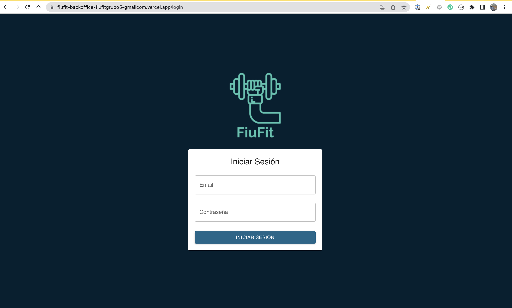

Una vez completados los datos se debe hacer click en “Iniciar sesión” y el sistema redirigirá a la siguiente pantalla en caso de éxito.

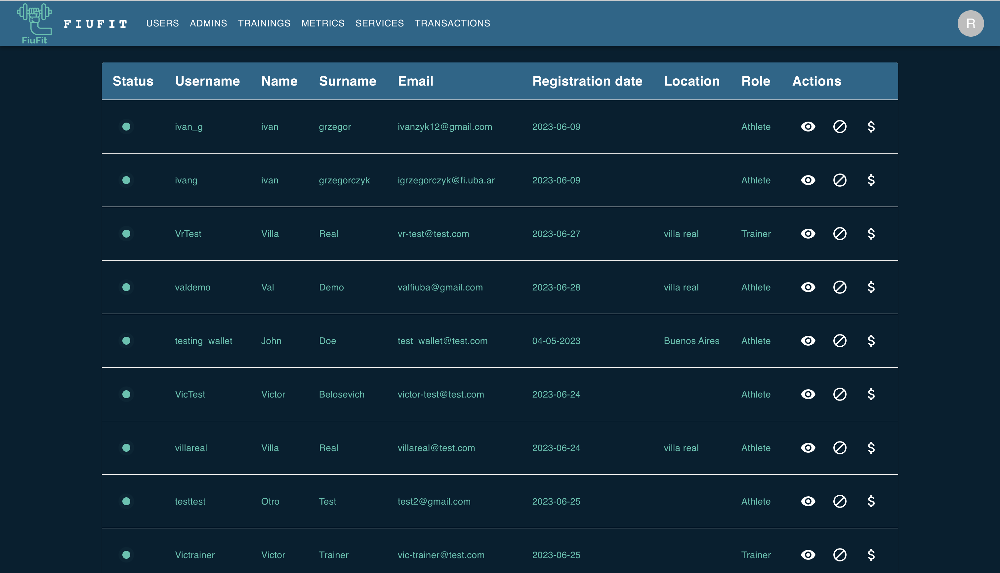

## Barra de navegación

Al iniciar sesión en el sistema se accede a una barra horizontal que permite navegar. Cada opción permite acceder a diferentes recursos del sistema:

1. *Users*: Permite visualizar la lista de usuarios con todas sus características, además se puede bloquear usuarios y cargarles saldo.
2. *Admins:* Permite visualizar la lista de administradores actuales, además se podrá crear usuarios nuevos con este rol.
3. *Trainings*: En esta sección se podrá visualizar el listado de entrenamientos disponibles en la plataforma, además se podrá bloquear un entrenamiento seleccionado.
4. *Metrics*: En esta sección se encontrarán métricas de usuario para relevar la cantidad de usuarios en la plataforma.
5. Services: Permite visualizar la sanidad del sistema. Aquí se podrá observar el si alguna API está caída y el uptime.
6. *Transactions*: En este listado se podrán ver las transacciones realizadas por los usuarios del sistema, cada vez que un usuario envíe un aporte a un entrenador, esto se verá reflejado en esta pantalla. 

## Usuarios

### Visualización

Al ingresar a la pantalla se observará lo siguiente, donde se verán un listado de los usuarios del sistema con paginación para poder llegar a ver todos los usuarios.

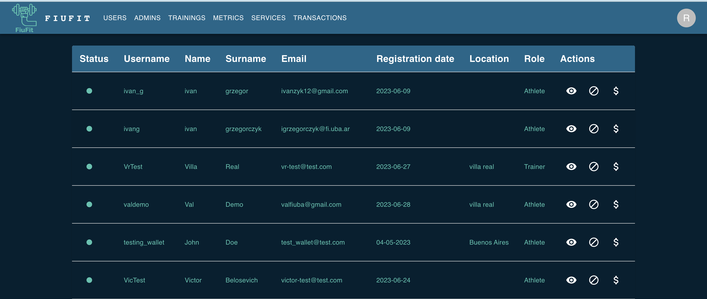

En la primera columna se puede ver el status que admite dos posibilidades: habilitado y bloqueado. En esta captura se ven todos los usuarios habilitados para operar en la plataforma.

Los usuarios que estén bloqueados aparecerán con el status en rojo y se grisarán en la grilla.

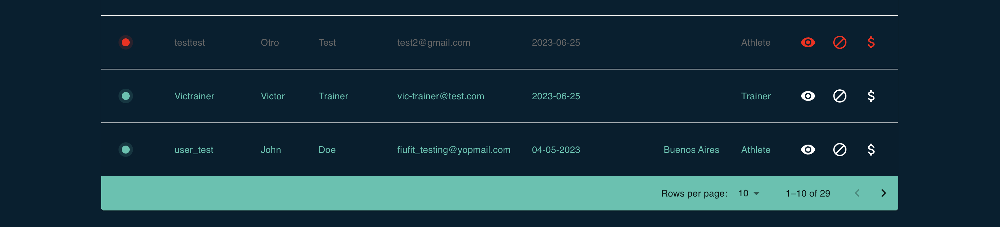

### Detalle de usuario

Para insertar a ver la información complementaria del usuario se selecciona el ícono del ojo en la columna “Actions” y aparecerá el siguiente modal.

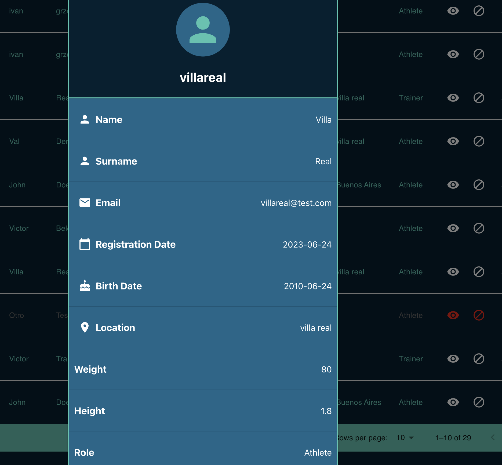

### Bloqueo

En este sistema se puede bloquear y desbloquear usuarios de la plataforma. Cuando un usuario es bloqueado en el sistema, no podrá loggearse dentro de la aplicación mobile Fiufit.

Para bloquear un usuario se debe identificar en la grilla y clickear en la columna “Actions” en el ícono del centro de la imagen.

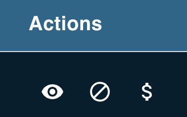

Como se mostró anteriormente, al realizar esta acción la fila pasará al estado rojo y se grisará dentro de la grilla para indicar que la operación fue realizada exitosamente.

### Carga de saldo

Para acceder a esta sección se debe clickear el símbolo de pesos en la grilla de usuarios y se observará la siguiente pantalla:

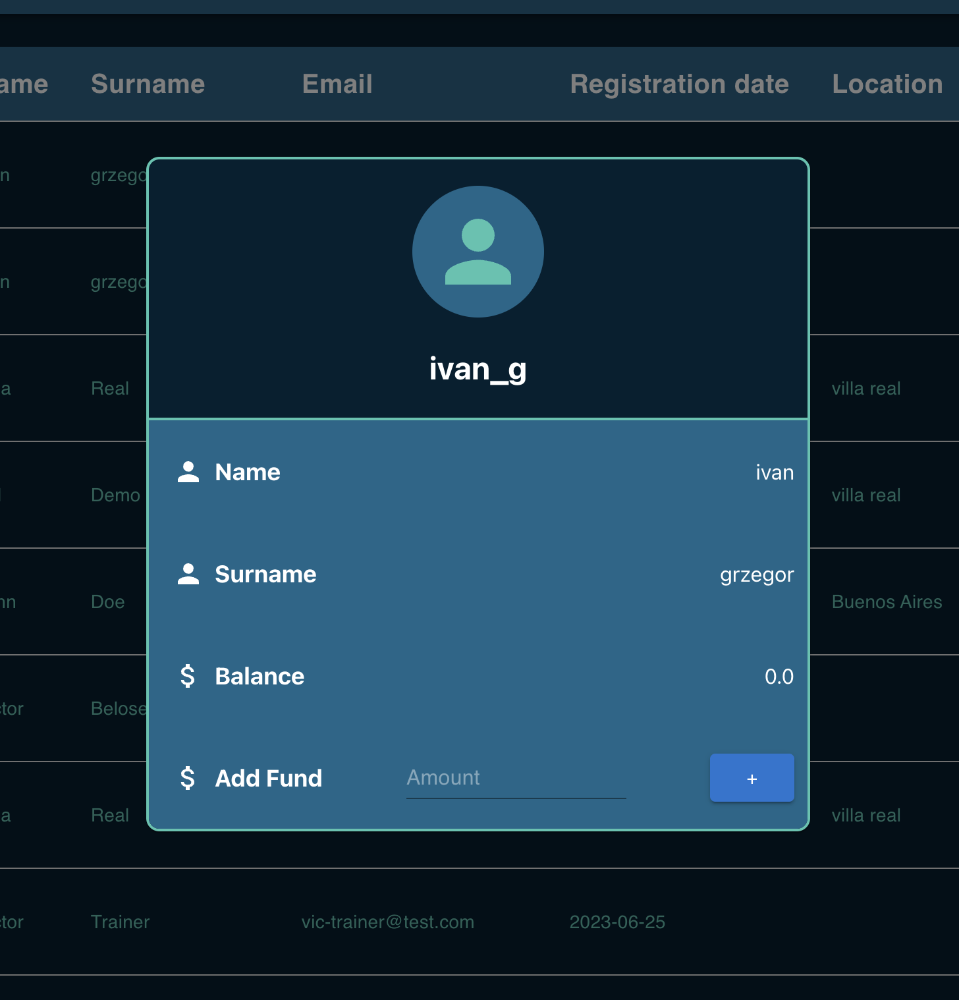

Al acceder a esta pantalla se puede ver la información del usuario al que vamos a agregarle saldo y su balance al momento.

Para proceder a realizar la operación se debe indicar el monto a cargar en el campo que aparece precargado como “Amount” y hacer click en el botón con el símbolo ‘+’.

Una vez que la operación sea realizada correctamente se actualizará el valor del balance del usuario. En caso de haber ocurrido un error en la carga del saldo, aparecerá un error en la pantalla y no se ingresará el monto al usuario.

## Administradores

En la pantalla de administradores se podrá ver el listado de todos los usuarios con el rol de administrador que se encuentran cargados en el sistema. Esta es la pantalla con la que se encontrará:

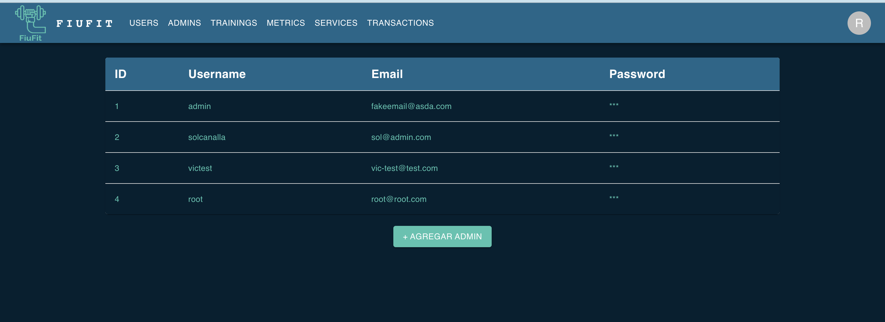

Para crear un nuevo administrador, es necesario clickear en el botón ‘+ Agregar admin’ y el sistema mostrará la siguiente pantalla:

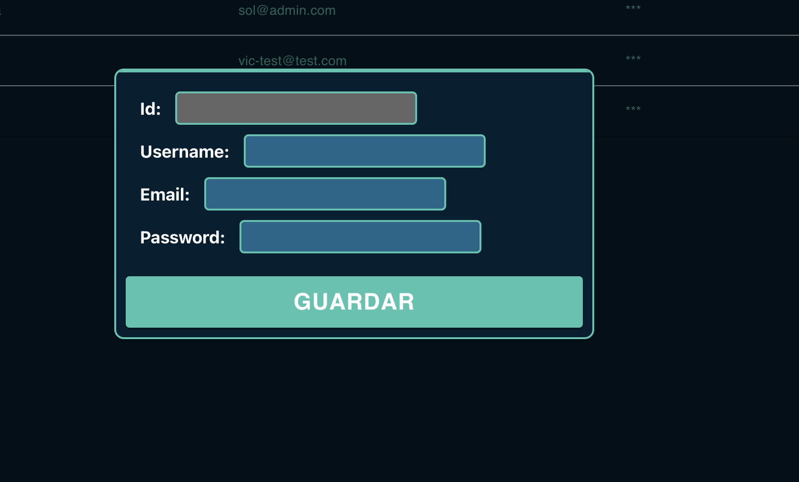

Todos los campos son requeridos para crear un usuario. Ellos son:

- *Username*: No hay restricciones para elegir un usuario
- *Email*: Se pide un formato de email correcto y que no exista ya como usuario en la plataforma.
- *Password*: Debe contener más de 8 caracteres para no obtener un error de validación.

En el caso de no cumplir con las validaciones de los campos, el sistema no permitirá seguir con la operación. Si se selecciona “Guardar” y el sistema acepta el nuevo admin, se refrescará la grilla de administradores con el nuevo usuario.

## Entrenamientos

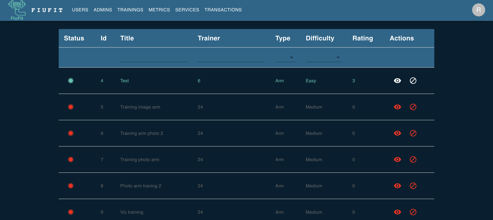

En esta grilla se pueden ver todos los entrenamientos de la plataforma, de la misma manera que con los usuarios se puede identificar los que están habilitados de los que están bloqueados a partir del color de la fila. 

Además se permite bloquear y desbloquear los entrenamientos.

Para tener más información detallada, de la misma forma que con los usuarios, se puede acceder mediante el ícono del ojo para abrir una pantalla con el detalle.

Como una facilidad adicional se permite utilizar filtros para buscar más rápidamente el entrenamiento deseado. Los filtros disponibles son: por tipo y dificultad.

## Servicios

En esta pantalla se pueden observar el listado de todas las APIs de la plataforma. De la misma manera que con usuarios y entrenamientos el campo status indica la sanidad del sistema.

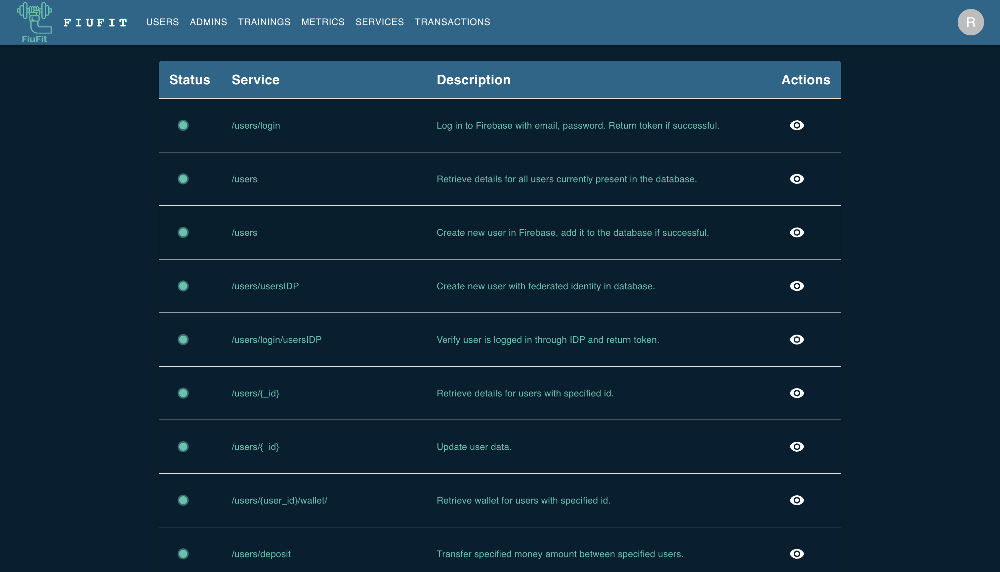

Para ver más detalles de los endpoints se debe ingresar al detalle donde se puede observar información como uptime e incluso link a la documentación.

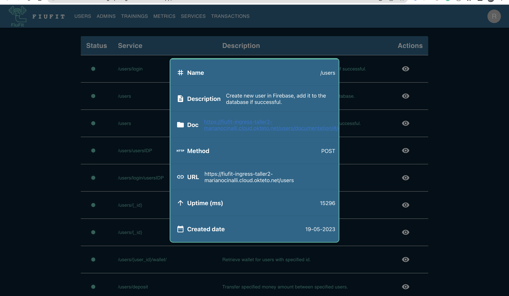

## Transacciones

La pantalla de transacciones es una pantalla que solo da visibilidad de la plata que se mueve dentro de la plataforma.

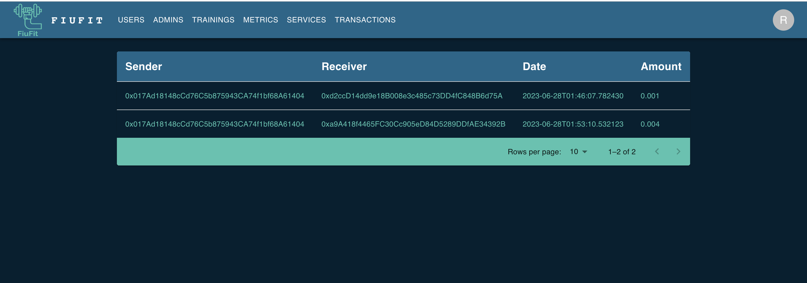

En este listado se pueden ver las billeteras del que envía y recibe, la fecha de la transacción y el monto que se transfirió.

## Métricas

Esta es la pantalla que permite dar visibilidad sobre la cantidad de usuarios que actualmente están usando la plataforma. 

En estas métricas de usuario se pueden ver los usuarios bloqueados, la forma en que los usuarios se loggean al sistema, y la zona en la que residen. Esta información se nutre de datos en real time.  

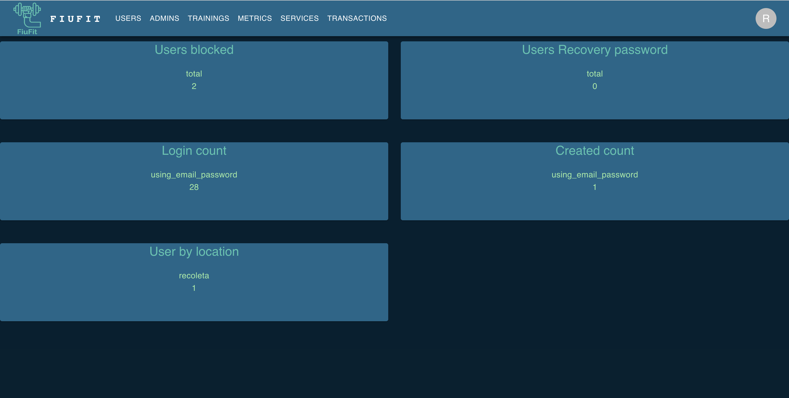
