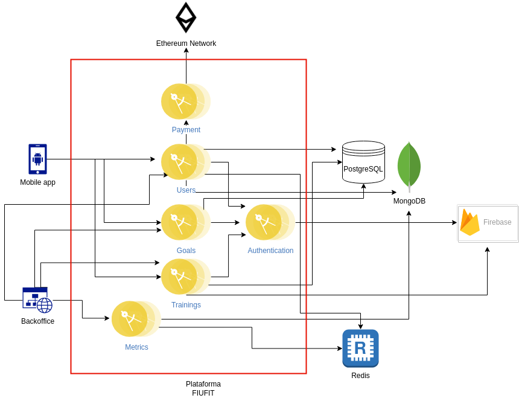

# Documentación técnica

## Arquitectura

Para el proyecto se empleo una arquitectura de microservicios, diagramada a continuación:

Se procede a listar los microservicios y detalles relevantes de cada uno, incluyendo sus principales dependencias y el lenguaje
y framework con el que fueron diseñados:

- Users: responsable de todas las operaciones relacionadas con los usuarios y administradores: creacion, logeo, edicion y visualizacion.
Tambien es el punto de acceso para el manejo de las billeteras de cada usuario, aunque no es responsable de efectivizar las mismas.
Utiliza PostgreSQL para almacenamiento de los datos de los usuarios, MongoDB para almacenamiento de sus respectivas posiciones y Redis para 
almacenamiento de metricas. Escrito en Python y utiliza FastAPI.
- Payment: responsable de efectivizar las transacciones efectuadas entre billeteras de la plataforma. Se utiliza la red de testeo Goerli.
Escrito en Javascript.
- Goals: se utiliza para las operaciones relacionadas con las metas del usuario: creacion, edicion y visualizacion. Tambien provee
informacion sobre el progreso en las metricas en general. Utiliza PostgreSQL como base de datos. Escrito en Python utilizando FASTApi.
- Authentication: encargado de regular la seguridad de la plataforma a traves de la creacion y decodificacion de los JWT (JSON Web Tokens) utilizados
para el acceso a los distintos recursos. Tambien provee acceso a Firebase, para el registro y logeo efectivo de cada usuario, y una carga
y descarga basica de imagenes a traves de Firebase Storage. Escrito en Go y utiliza Gin.
- Trainings: Maneja los distintos entrenamientos: su creacion, edicion y visualizacion. Tambien comprende las distintas interacciones
posibles de los usuarios con estos: marcarlos como favoritos, asignarles un puntaje, etc. Utiliza PostgreSQL como base de datos. Escrito en Python y utiliza FastAPI
- Metrics: 