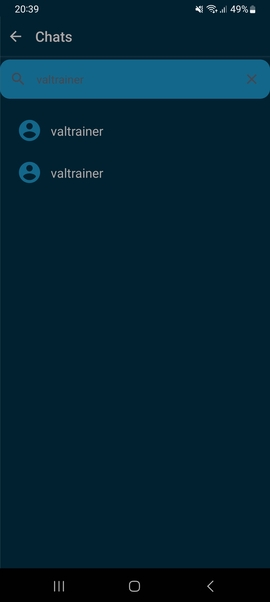
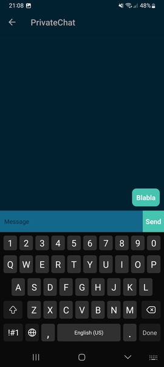

# Manual de usuario - Chateo

La aplicacion permite conectarse a otros usuarios de la plataforma para tener conversaciones. Para iniciar una conversacion, 
clicar la imagen de perfil en la esquina superior izquierda del dashboard principal

Esto abrira un menu donde se puede seleccionar la opcion chats

Aqui se pueden buscar usuarios por nombre de usuario e iniciar una conversacion 

Una vez iniciada una conversacion se pueden enviar mensajes tan solo escribiendolos y apretando Send

Estos mensajes le seran notificados al otro usuario y este podra acceder a la conversacion para responder.