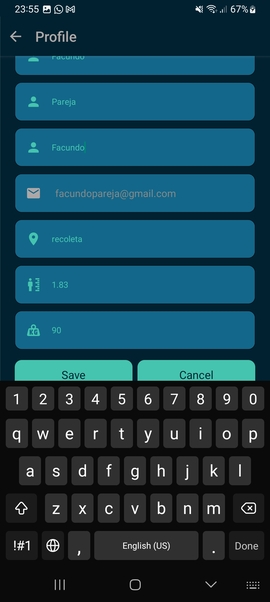
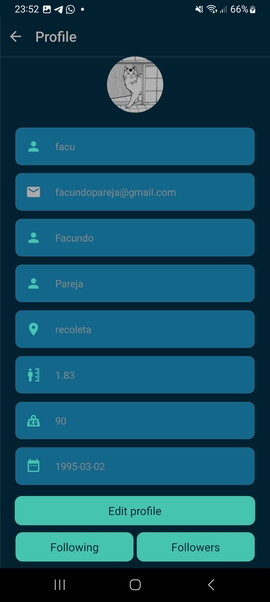

# Manual de usuario - Edicion de perfil

Para acceder a la edición, se puede clicar el icono de la esquina superior izquierda, que nos conducirá a la 
siguiente pantalla:

Si se clica Profile y luego Edit profile, se puede acceder a la edición del perfil de usuario.  
No es posible modificar todos los detalles de usuario, el email y la foto no son modificables.

Una vez realizado el cambio, presionar Save para guardar.

