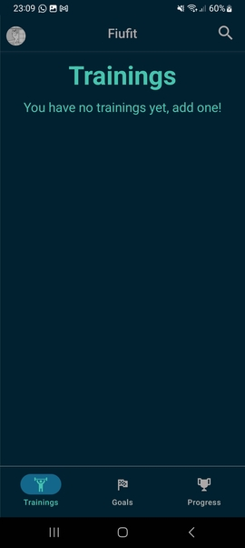
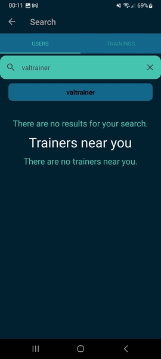
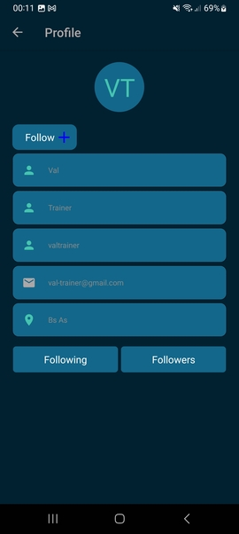
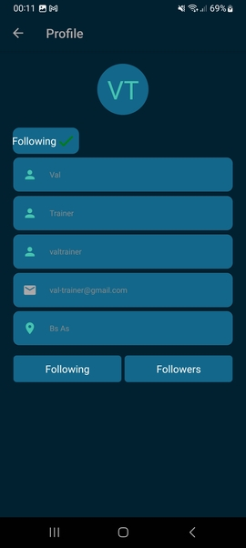
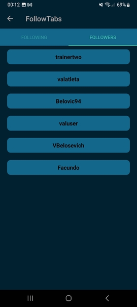
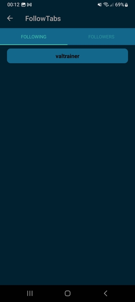

# Manual de usuario - Seguimiento de usuarios

Es posible seguir a entrenadores para conocer sus entrenamientos. Para lograrlo, clicar la lupa presente en la esquina superior
derecha de la siguiente imagen:

En la tab de users se puede colocar el nombre de entrenador a buscar.

Al clicarlo se pueden ver los detalles publicos del entrenador, y aparece la opcion para seguirlo

Luego de clicarla, deberia aparecer el entrenado como seguido.

Es posible verificar que se aparece en los seguidores del entrenador.

Y si se accede al perfil propio (mediante el metodo descrito en la seccion de edicion de perfil) se pueden consultar los 
seguidos por uno mismo.

