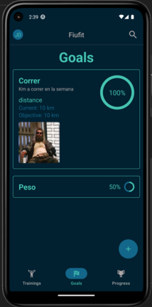

# Manual de usuario - Objetivos

La primera vez que se ingrese a la pantalla de objetivos se verá de la siguiente manera:

Al presionar en el botón flotante se abrirá un formulario para crear un objetivo. En el mismo se debe completar la siguiente información:

Luego se verán listados los obetivos en la pantalla original. Al mantener presionado unos segundos un objetivo el mismo queda marcado y desbloquea dos opciones, la primera para editar y la segunda para eliminar como se ve a continuación:

Al editar un objetivo se le puede ir cargando el progreso

Finalmente al presionar sobre un objetivo, el mismo se extiende para mostrar toda la información del mismo.

