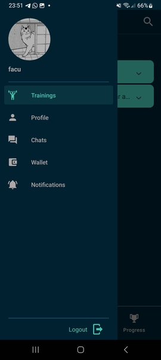
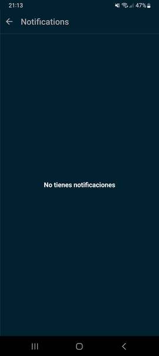

# Manual de usuario - Notificaciones

El sistema guarda las notificaciones para posterior lectura del usuario. Para acceder a las mismas, 
clicar la imagen de perfil en la esquina superior izquierda del dashboard principal 

Clicar Notifications. Aqui se podran ver todas las notificaciones listadas.

