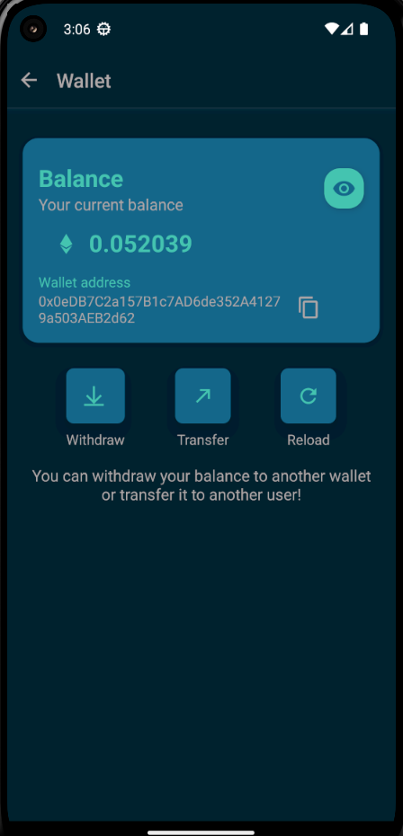
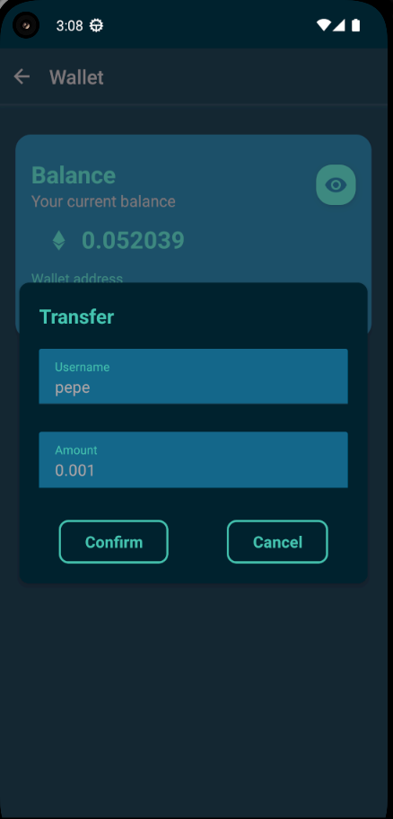

# Manual de usuario - Pagos

Al ingresar a la pantalla de pagos se podrá observar lo siguiente:

Al presionar los botones de retiro o transferencias se abrirá un formulario como el siguiente. Simplemente se deben completar los datos requeridos para realizar la transferencia.

Para extraer la plata repetir el mismo procedimiento pero clickando en Withdraw. Esto requiere una billetera externa 
al sistema Fiufit.

IMPORTANTE: Recordar que solo es posible tranferir plata a entrenadores, no a cualquier usuario.