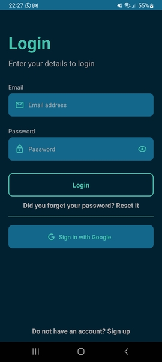

# Manual de usuario - Registro y login

Al abrir la aplicación se podrá ver la siguiente pantalla :

En caso de ser un usuario primerizo, no se tendrá una cuenta disponible. Clickar sign up (al fondo). Esto nos llevará a la siguiente imagen:

Aquí se debe colocar la siguiente información:

- Email
- Contraseña
- Confirmación de contraseña

Si hay algún error en la información introducida, se le informará en rojo arriba del campo relevante. Una vez que todos los campos han sido completados satisfactoriamente, apretar Next.

A continuación se le requerirán los datos personales:
- Nombre
- Apellido
- Nombre de usuario
- Locación (opcional, pero necesaria para el funcionamiento de la geolocalización). 
Una vez completo, clicar Next

La última pantalla del registro requiere los siguientes datos fisiológicos:

- Rol (atleta o entrenador)
- Peso
- Altura
- Fecha de nacimiento
- Imagen de perfil (opcional)

En ambas pantallas, si hay algún error en la información introducida, se le informará en rojo arriba del campo relevante.

Para terminar el proceso, clicar Register. El usuario se creará y notificará el éxito de la operación, volviendo a la pantalla de login. Finalmente, se puede logear colocando la información correspondiente en email y password.

