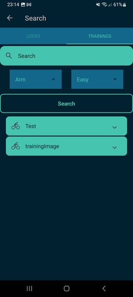
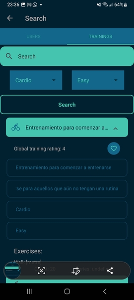
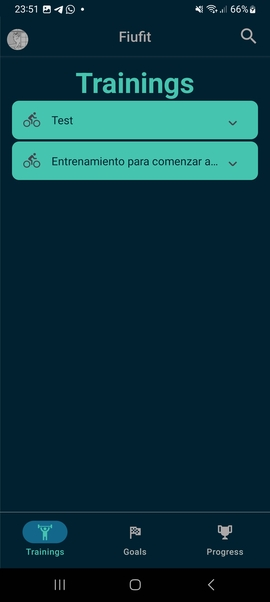
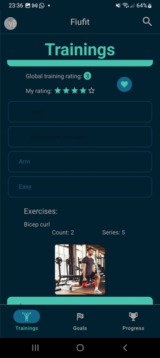

# Manual de usuario - Entrenamientos

Un usuario recien creado no tendra entrenamientos nuevos, como se puede observar. 

Clicar la lupa para acceder a la búsqueda de entrenamientos y agregar uno. Observese que es posible filtrar por 
- Nombre
- Tipo
- Dificultad
Los resultados apareceran abajo del boton Search

Al clicar el entrenamiento se puede ver detalles sobre el mismo:
- Nombre
- Descripción
- Tipo
- Dificultad
- Foto en caso de que la tenga 

Se lo puede agregar a favoritos clicando el corazón.

Al volver a la pestaña de trainings, se observara que el training aparece en la lista:

Luego de clicarlo, se puede asignar un puntaje al mismo, que afectara el promedio.

